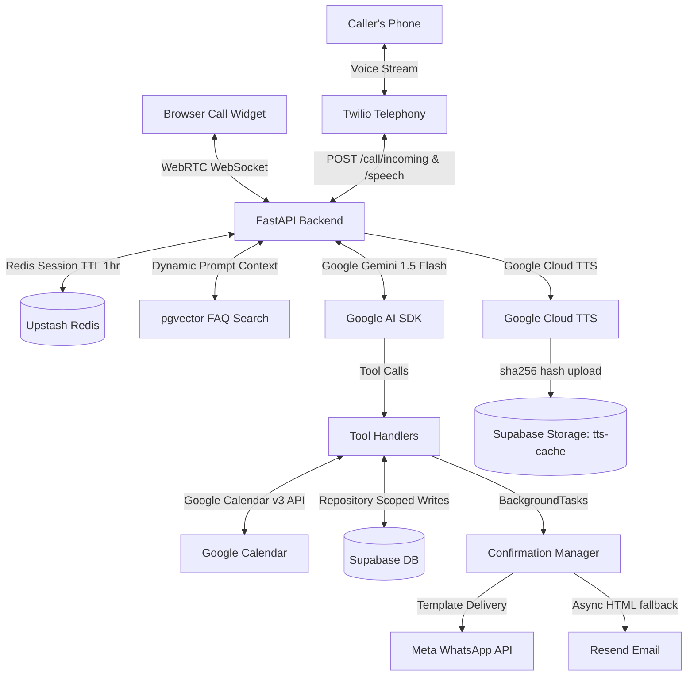

# Helio — Production-Ready AI Voice Receptionist SaaS

> **Every call answered. Every customer heard.**

Helio is an autonomous, multi-tenant AI Voice Receptionist SaaS designed to help small businesses (salons, clinics, tutors, repair shops) manage their calls. Helio answers incoming telephone calls, books appointments directly into Google Calendar, answers FAQ queries using semantic search, delivers template confirmations via WhatsApp and email, and escalates calls to human staff when needed.

---

## 1. System Architecture



---

## 2. Core Operational Workflows

### 2.1. Telephony Webhook Loop
1. **Inbound Trigger:** An incoming dial to the Twilio phone number triggers a `POST` request to `/call/incoming`.
2. **Working Hours Check:** The server validates the business's open hours config based on its local timezone.
   - If closed, a pre-synthesized after-hours message plays, and the call is terminated.
   - If open, the server inserts a call log in Supabase, spins up a Redis session (1-hour TTL), caches the greeting, and returns a TwiML `<Gather input="speech">` node.
3. **Speech & Translation:** When the caller speaks, Twilio transcribes the speech and sends it via `POST` to `/call/speech`.
4. **AI Receptionist Execution:**
   - The server loads the session transcript from Redis.
   - Generates a text embedding of the caller's message and runs a cosine similarity query against the tenant's FAQs.
   - Compiles a dynamic system prompt with matching FAQs, timezone, date, services, and business rules.
   - Instantiates a `GenerativeModel` using Gemini 1.5 Flash with the prompt passed as `system_instruction`.
5. **Tool Execution:** Gemini responds with either conversational text or structured tool calls (`check_availability`, `book_appointment`, `escalate_to_human`).
   - If a tool call is requested, the server executes it, updates the session, and feeds the results back to Gemini for a final response.
6. **Audio Delivery:** The final text response is synthesized into an MP3 (cached by `sha256` content-hash in Supabase Storage) and returned as a TwiML `<Play>` node with a new `<Gather>` listener.

---

## 3. Algorithms & Concept Architecture

### 3.1. Cosine Similarity FAQ Injection
To answer customer FAQs accurately without inflating prompt token counts, Helio runs vector similarity searches on the fly:
1. When the business adds/edits FAQs, the server generates a 768-dimensional float vector using Google's `text-embedding-004` and updates Supabase.
2. During a call turn, the user's input is vectorized and queried using the PostgreSQL cosine operator (`<=>`):
   $$\text{Similarity} = 1 - (\vec{u} \cdot \vec{v})$$
3. The top 3 matching Q&A records above a $0.7$ similarity threshold are injected into the dynamic system prompt.

### 3.2. Google OAuth Auto-Refresh Callback
Google OAuth access tokens expire hourly. To handle refreshes without interrupting calls, Helio intercepts credential refreshes:
- The standard `creds.refresh` method is wrapped with a callback.
- When an expired token is refreshed, a FastAPI background task updates the Supabase record.

### 3.3. Thread Pool Task Delegation (`asyncio.to_thread`)
To maintain response times of $<2$ seconds under load, blocking I/O calls to Google APIs, Supabase Storage, and Resend are offloaded to background threads using `asyncio.to_thread()`, keeping the main async event loop free.

---

## 4. Multi-Tenant Directory Layout

```
Helio/
├── apps/
│   ├── api/                           # FASTAPI BACKEND (Railway)
│   │   ├── config.py                  # Pydantic environment configurations
│   │   ├── main.py                    # Root FastAPI application router
│   │   ├── models/
│   │   │   ├── database.py            # Supabase instance + Scoped Repository patterns
│   │   │   └── schemas.py             # Pydantic schemas (e.g., CallSession)
│   │   ├── routers/
│   │   │   ├── call.py                # Telephony webhooks
│   │   │   ├── booking.py             # CRUD router for appointments
│   │   │   ├── business.py            # Onboarding & integrations setup
│   │   │   ├── dashboard.py           # Metrics aggregation
│   │   │   └── widget.py              # WebSocket endpoint for browser audio
│   │   ├── services/
│   │   │   ├── llm.py                 # Gemini orchestrator
│   │   │   ├── calendar.py            # Google Calendar v3 integration
│   │   │   ├── tts.py                 # Audio synthesis cache manager
│   │   │   ├── vector_search.py       # FAQ similarity queries
│   │   │   └── confirmations.py       # Notification orchestrator (WhatsApp/Email)
│   │   ├── tools/
│   │   │   ├── definitions.py         # Gemini Tool definitions
│   │   │   └── handlers.py            # Live tool call executions
│   │   └── prompts/
│   │       └── system.py              # Dynamic system prompt compilation
│   │
│   └── web/                           # NEXT.JS 14 FRONTEND (Vercel)
│       ├── app/
│       │   ├── (auth)/                # NextAuth Login/Register
│       │   ├── (dashboard)/           # Overview charts, calls transcript, appointments
│       │   └── globals.css            # Dark mode styles & custom tailwind rules
```

---

## 5. Development Setup

### 5.1. Backend Installation
1. Navigate to the API folder:
   ```bash
   cd apps/api
   ```
2. Set up a virtual environment and install dependencies:
   ```bash
   python3 -m venv venv
   source venv/bin/activate
   pip install -r requirements.txt
   ```
3. Start the hot-reloading development server:
   ```bash
   uvicorn main:app --reload
   ```

### 5.2. Frontend Installation
1. Navigate to the Web folder:
   ```bash
   cd apps/web
   ```
2. Install dependencies:
   ```bash
   npm install
   # or
   pnpm install
   ```
3. Start the Next.js development server:
   ```bash
   npm run dev
   # or
   pnpm dev
   ```

---

## 6. Production Deployment

### 6.1. Backend (Railway)
Deploy the FastAPI backend directory directly using the Railway CLI:
```bash
cd apps/api
railway up
```

### 6.2. Frontend (Vercel)
Deploy the Next.js frontend directory to Vercel. Ensure the client environment variables (`NEXT_PUBLIC_API_BASE_URL` and `NEXT_PUBLIC_SUPABASE_URL`) are configured in the Vercel project settings.
